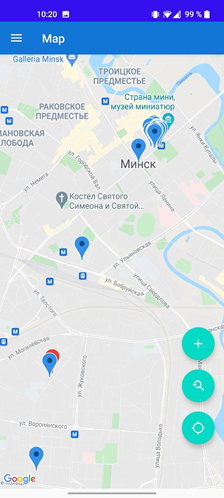
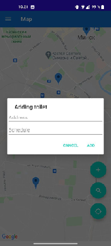
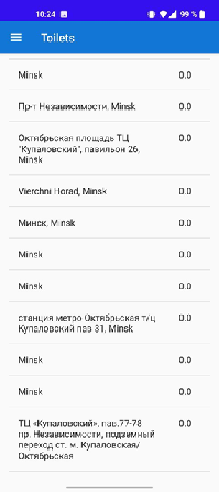
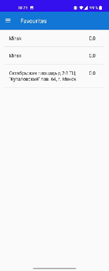

# 1. Введение
## 1.1 Назначение
Сервис для поиска ближайших общественных туалетов на основе текущей геолокации пользователя.
## 1.2 Бизнес-требования
### 1.2.1 Границы проекта
Пользователь, заходя в приложение, сможет увидеть ближайшие общественные туалеты. Помимо этого, будет возможность оценивания по пятибальной шкале, а также добавление ненайденных точек справления нужды.
### 1.2.2 Аналоги
На данный момент аналогов данного приложения нет.

---
# 2. Требования пользователя
## 2.1 Программные интерфейсы
Приложение будет разрабатываться на языке Java
## 2.2 Интерфейс пользователя

Экран карты с маркером пользователя и маркерами туалетов в радиусе 5 км

Форма предложения туалета

Форма предложения туалета

Список избранных пользователем туалетов в радиусе 5 км
## 2.3 Характеристики пользователей
### 2.3.1 Классы пользователей
1. Незарегестрированный класс пользователей может пользоваться всем функционалом приложения, кроме оставления отзывов.
2. Зарегестрированный класс пользователей может пользоваться всем функционалом приложения.
### 2.3.2 Аудитория приложения
Приложение расчитано на всех пользователей вне зависимости от возраста, которые часто совершают пешие прогулки по городу.
## 2.4 Предположения и зависимости
Приложение предназначено для работы в ОС Android.

---
# 3. Сиситемные требования
## 3.1 Функциональтные требования
| Функция                        | Требование                                                                   |
|--------------------------------|------------------------------------------------------------------------------|
| Регистрация в приложении       | Приложение предоставит возможность регистрации с помощью аккаунта Google     |
| Предложить новый туалет        | Вывод соответствующей формы                                                  |
| Написать письмо с предложением | Вывод соответсвующей формы                                                   |
| Просмотреть любимые туалеты    | Вывод списка избранных туалетов с возможностью просмотра информации о каждом |
| Просмотреть туалеты в радиусе  | Вывод соотвутствующего списка                                                |
| Оставить отзыв                 | Вывод соответсвующей формы                                                   |

## 3.2 Нефункциональные требования
### 3.2.1 Атрибуты качества
Атрибутами качества являются: легкость использования засчет минималистичного интерфейса, удобство в использовании пользователями любого уровня технической грамотности.
### 3.2.2 Внешний интерфейс
Приложение должно быть разработано в простом, минималистичном стиле, иметь доступ к интернету, GPS и местоположению.