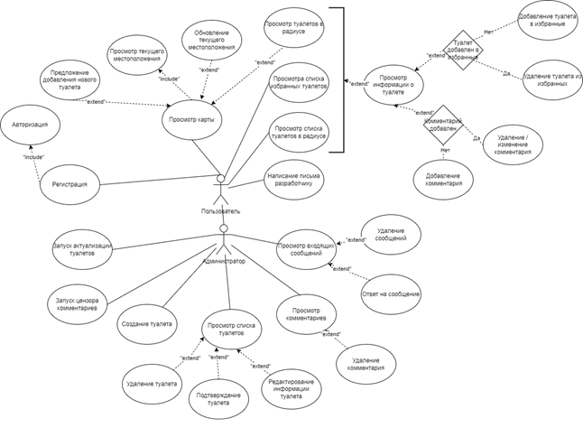
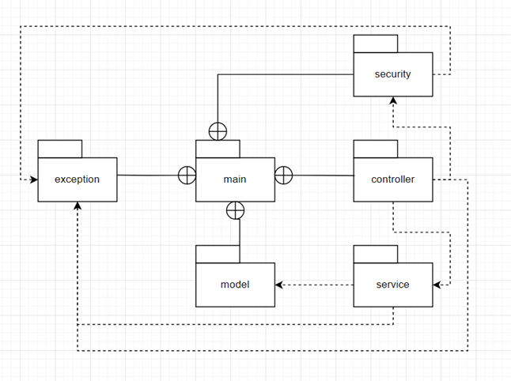
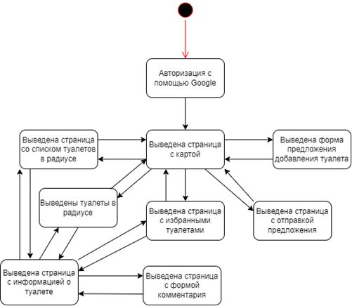
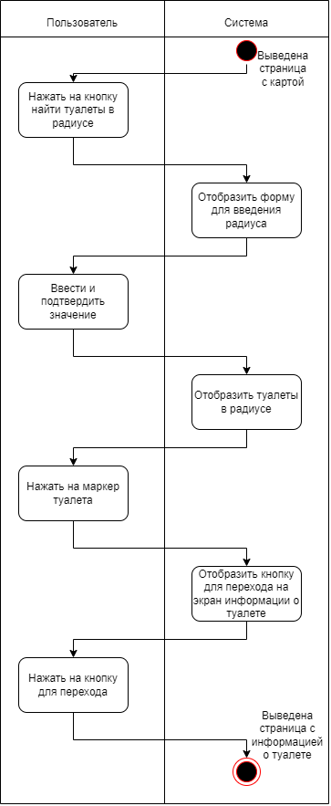

# Построение UML диаграммы
Функциональную модель предметной области представлена в виде диаграммы вариантов использования в нотации UML, представляющей систему в виде набора варианта использования и актеров, взаимодействующих с ними. В рамках предметной области можно выделить двух актеров: администратор и пользователь.

# Построение диаграммы классов
Все классы логически можно разделить на 6 пакетов: 
- main – пакет, содержащий все классы приложения. 
- exception – пакет, содержащий классы исключений. 
- model – пакет, содержащий классы доменных моделей. 
- service – пакет, содержащий классы с бизнес-логикой. 
- controller – пакет, содержащий классы для обработки запросов к веб-сервису. 
- security – пакет, содержащий классы с логикой, касающейся безопасности веб-сервиса.

# Диаграмма состояний
После запуска приложения система принимает состояние “Авторизация с помощью Google”, после чего отображает страницу с картой. 
Дальнейшие состояния зависят от функции или операции, выбранной пользователем. 

Если пользователь выбрал предложить туалет, будет выведена форма для предложения. 

Если пользователь выбрал функцию вывести туалеты в радиусе, на карте будут отображены их маркеры, и он сможет просмотреть информацию о каждом. 

Если пользователь выбрал функцию написать письмо с предложением, будет выведена соответствующая форма. 

Если пользователь выбрал функцию просмотреть избранные, будет выведен список избранных туалетов с возможностью просмотреть информацию о каждом. 

Если пользователь выбрал функцию просмотреть список туалетов в радиусе, будет выведен список туалетов с возможностью просмотреть информацию о каждом.

# Диаграмма активностей

Активность предполагает состояние “Страница с картой” и включает следующие действия: 
- Пользователь нажимает на кнопку поиска туалетов в радиусе 
- Система выводит форму для ввода радиуса 
- Пользователь вводит желаемое значение и нажимает на кнопку 
- Система отображает на карте маркеры найденных туалетов в заданном радиусе 
- Пользователь нажимает на маркер желаемого туалета 
- Система отображает кнопку для перехода на экран информации о туалете 
- Пользователь нажимает на кнопку для перехода 
- Система выводит страницу с информацией

# Диаграмма компонентов системы

На этапе разработки система включает следующие компоненты: 
- Database – компонент базы данных. 
- Web API – компонент веб-сервиса, содержит всю core бизнес-логику системы. 
- Android client – компонент клиентского приложения для ОС Android, общается с компонентом Web API посредством HTTP-запросов. 
- Maintenance service – компонент сервиса технического обслуживания, общается в компонентом Web API посредством HTTP-запросов.

