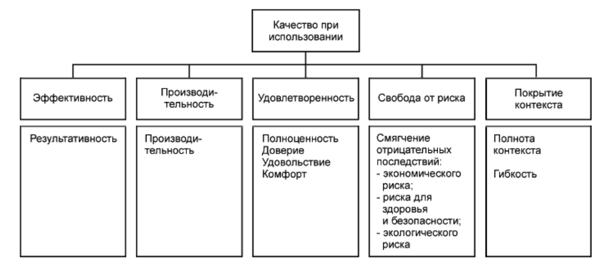
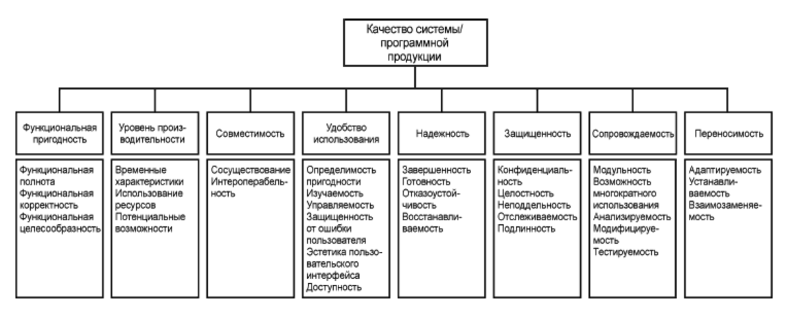

# План тестирования
## Введение
Тестирование необходимо для проверки корректности работы приложения.
## Объект тестирования
Объектом тестирования явлется сервис по поиску общественных туалетов.

Модель качества при использовании
---

Модель качества продукта
---
## Риски
Очень важно проверить, работоспособно ли приложение при высоком количестве запросов от пользователей.
## Аспекты тестирования
В ходе тестирования необходимо проверить следующие компоненты:
- Корректная работа регистрации 
- Корректная обработка запросов пользователя
- Быстрая и корректная функция определения геолокации
- Работоспособность приложения при высоком количестве запросов от пользователей
## Подходы к тестированию
Для тестирования необходимы 
- Телефон с установленным приложением 
- 9 человек с установленным приложенем на телефонах 
## Представление результатов
| Действие                                                | Ожидаемый результат                                                                                 |
|---------------------------------------------------------|-----------------------------------------------------------------------------------------------------|
| Регистрация в приложении                                | Вывод предложение авторизоваться через аккаунта Google                                              |
| Нажатие кнопки "Предложить новый туалет"                | Вывод формы заполнения информации о туалете                                                         |
| Нажатие кнопки "Написать письмо с предложением"         | Вывод соответсвующей формы                                                                          |
| Нажатие кнопки "Любимые туалеты"                        | Вывод списка избранных туалетов с возможностью просмотра информации о каждом                        |
| Нажатие кнопки "Просмотреть туалеты в радиусе"          | Вывод соотвутствующего списка                                                                       |
| Нажатие кнопки "Оставить отзыв"                         | Вывод соответсвующей формы, поступление отправленного пользователем сообщения на почту разработчика 
| Использование приложения 10 пользователями одновременно | Исправная работа приложения у каждого пользователя                                                  

## Вывод
Приложение работает идеально.